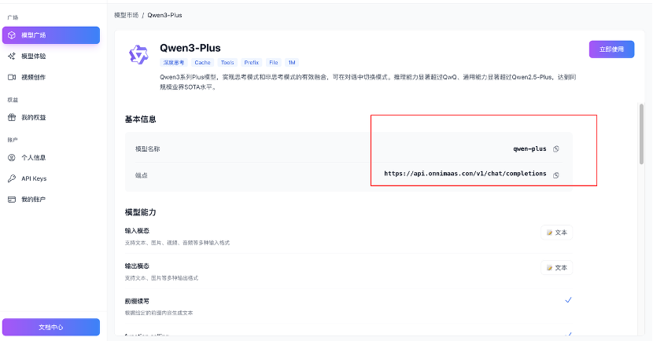
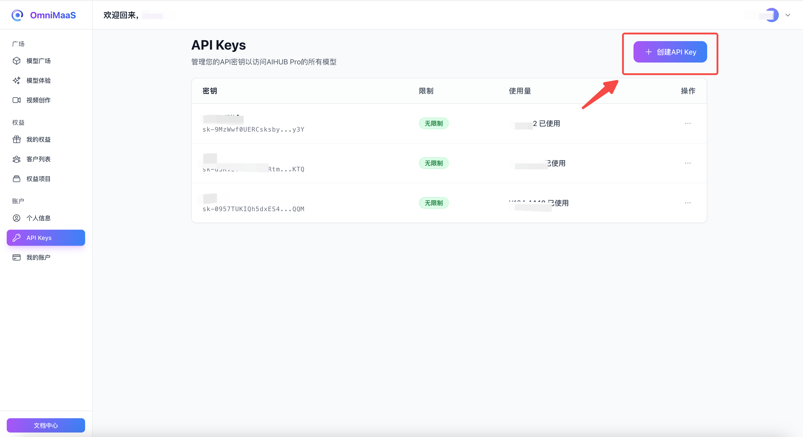
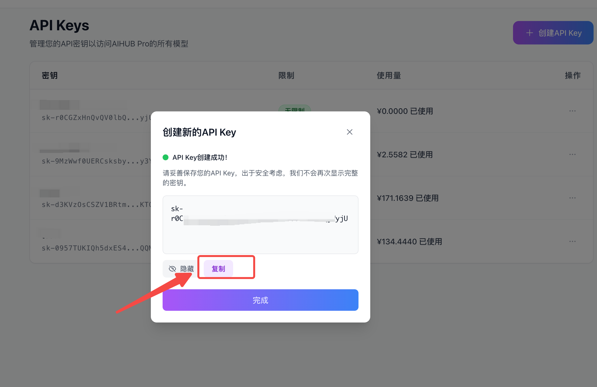
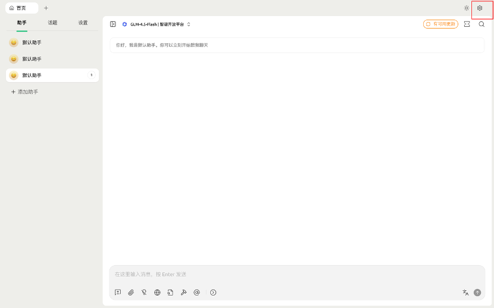
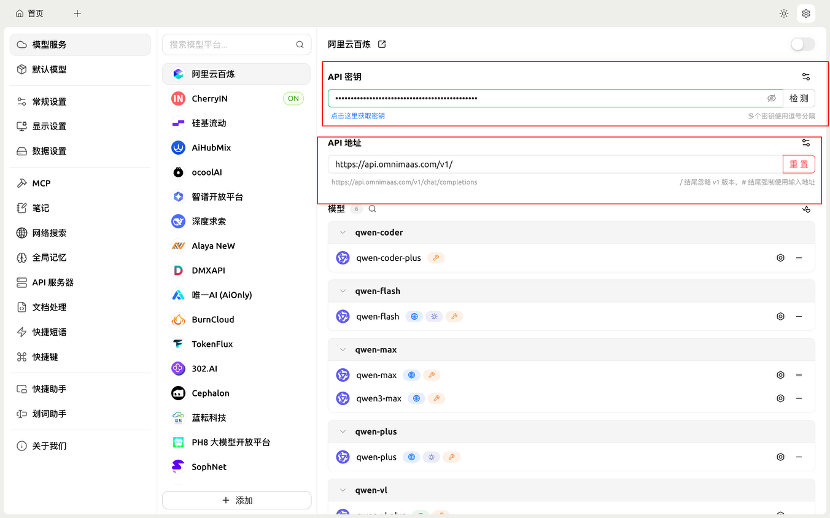
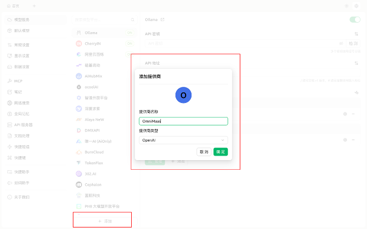
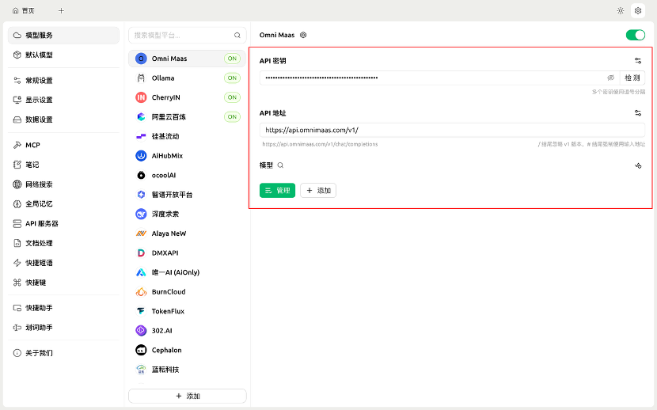
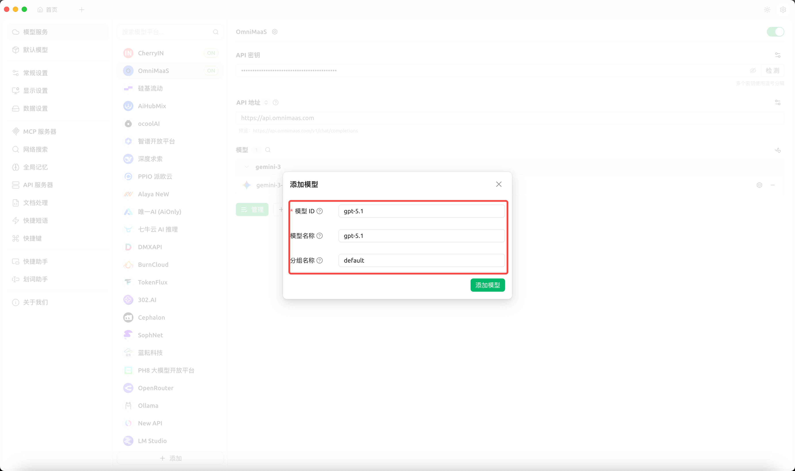
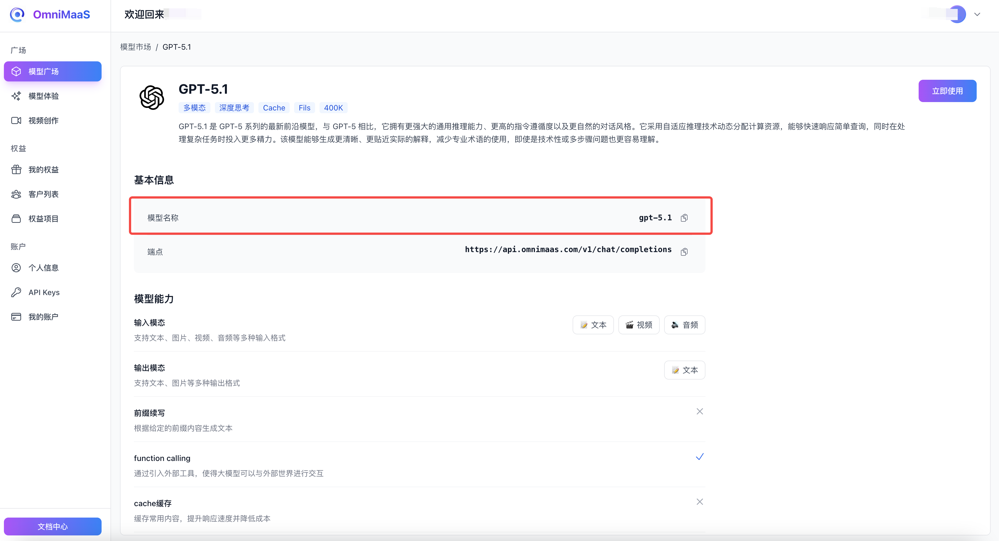
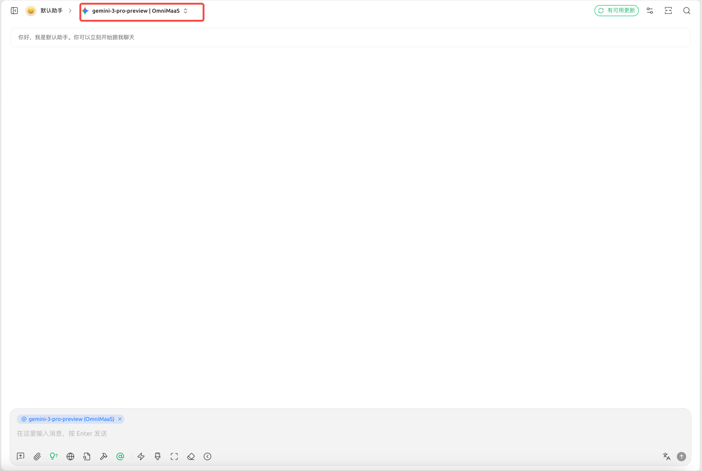

# Cherry Studio客户端配置
## Cherry Studio下载地址
官方地址：https://www.cherry-ai.com/

## 获取API地址和密钥

1. 打开OmniMaas平台获取API地址，可以通过点击“模型广场”中的任意一个模型进入到“模型详情”，可通过模型详情来查API地址.

2. 打开OmniMaaS，点击左侧“账户”-“API Keys”菜单，在该页面完成Key创建并复制key

## 配置步骤

### 进入设置

打开Cherry Studio首页，点击右上角设置

### 配置模型

#### 方案一：直接使用官方提供商模式

在“模型服务”页面找到“阿里云百炼”提供商，将这里的“API密钥”更换为从OmniMaaS平台获取的API_Key，以及将API地址改为：https://api.omnimaas.com即可.

#### 方案二：自定义OmniMaaS集成方式

1. 点击下列的添加按钮，输入"OmniMaaS"提供商名称，并选择对应的提供商类型，这里以“OpenAI”为例：

2. 输入OmniMaaS的API地址和密钥

将这里的“API密钥”更换为从OmniMaaS平台获取的API_Key，以及将API地址改为：https://api.omnimaas.com即可。

3. 添加模型

4. 模型名称填写

这里的模型ID对应的是OmniMaaS平台中“模型广场”-“模型详情”里的模型“模型名称”:

需要注意的是，这里的"分组名称"默认为：default

5. 使用模型

在使用时，只需要选择已经配置好的模型名称即可：

